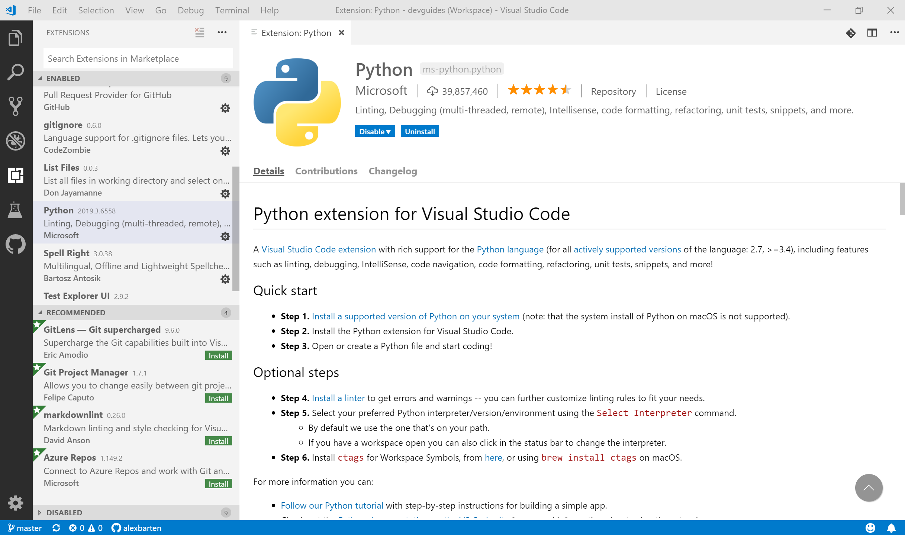

# How to setup a Python programming project  

## Contents

1. [Introduction](#Introduction)  
1. [Setting up Visual Studio Code](#Setting-up-Visual-Studio-Code)  
   * [Python configuration](#Python-configuration)  
   * [How to deal with keyboard shortcuts](#How-to-deal-with-keyboard-shortcuts)  
   * [Adding a linter](#Adding-a-linter)  
   * [Other nice extensions](#Other-nice-extensions)  
1. [Create your project environment and create a Git repository](#Create-your-project-environment-and-create-a-Git-repository)  
1. [Set VSCode as default .gitconfig editor](#Set-VSCode-as-default-.gitconfig-editor)  
1. [Configure .gitignore](#Configure-.gitignore)  
1. [Add source files to the local Git repository](#Add-source-files-to-the-local-Git-repository)  
1. [Sync local Git repository to GitHub for the first time](#Sync-local-Git-repository-to-GitHub-for-the-first-time)  
1. [Unit testing](#unit-testing)  
1. [Add support for Behavior Driven Development (BDD)](#Add-support-for-Behavior-Driven-Development-(BDD))

## TODO
- Explain how to sync between local and remote repos (Git <--> GitHub)    


## Introduction

This document has been constructed for developers who want to start coding Python in a distributed project (with a Git server). It is aimed at enterprise developers, but anyone can obviously use this documentation.  

I wrote this document, because it took me quite some time to gather the information required to have a well functioning set up. Lots of introductions on the internet skip important steps or assume a lot of knowledge on the part of the reader, or are just incomplete or stale. At the same time a lot of developers ask questions about these steps, for instance on StackOverflow.  

Consequently, I have tried to address the flaws of other descriptions, for example how to set up a HTTPS-connection to GitHub. Even GitHub's own documentation on this topic is both incomplete and flat out wrong.  

In this document I assume that you will use Visual Studio Code as your code editor.  

*Disclaimer: the current version is work in progress, and as such quite incomplete. This will change over time.*

---


## Setting up Visual Studio Code

Microsoft Visual Studio Code (VSCode) is a free and lean code editor, that supports web programming languages (HTML, (S)CSS, JavaScript, TypeScript) and a number of web frameworks out of the box.  

It is actively maintained for Windows, Linux and MacOS.  

VSCode is very popular, and thousands of extensions have been created to add functionality. This is the architecture of VSCode - it provides very flexible extension APIs, which can use and integrate with nearly any functionality of the editor.  

As a user, you are expected to extend the editor until it fits your needs. That is what we will do in this section.  


### Python configuration

To enable Python in VSCode, you need to install the official (Microsoft) Python extension.  

Press *control shift X* to open the Extensions pane. Type *python* in the search and filter input field at the top of the pane. A lot of options will pop up. Select the Python extension, authored by Microsoft, and install it. It should be at or near the top of the suggestion list. Alternatively, go to the [official Microsoft Python extension web page](https://marketplace.visualstudio.com/items?itemName=ms-python.python) and install the extension from there.  



Note that you need to have Python (the language) installed on your computer to be able to use the extension. If that is not the case, [download and install the latest version](https://www.python.org/).  

After installing the extension, you can start programming right away. To improve the programming experience, you are invited to configure VSCode to suit your needs. One suggestion is to add vertical rulers on position 72 (for Docstrings) and 79 (for Python code). You can add these by configuring a workspace (= project) specific configuration file, or on a global level. This is how it works:  

* Open Settings (*control ,*)  
* Click on the accolade **{ }** icon in the top right of the VSCode window.  
* *settings.json* is opened in a tab. This is your local configuration file.  
* Add this code to settings.json:  

``` json
{
    "[python]": {
        "editor.wordWrap": "wordWrapColumn",
        "editor.rulers": [
            72,
            79
        ]
    }
}
```

When you save the file, vertical rulers will pop up when you edit a Python source file.  


### How to deal with keyboard shortcuts

Mastering your keyboard eases your life and makes you more productive. With this in mind, VSCode has a very flexible and accessible way to deal with keyboard shortcuts.  

To see all your active keyboard shortcuts, press *control k* + *control s*. By the way, the *control k* shortcut gives you access to a lot of combinations. When you press it, a message will pop up in the VSCode status bar.  

A new tab is opened which lists all commands available in VSCode. These commands can be entered manually in the Command Palette (= Show All Commands dialogue) that you enter by pressing *control shift p*. You can filter through the list when you start typing in the search line.  

Now you can study which key bindings (= shortcuts) have been assigned to which commands, and you can easily add new ones. Take your time to go through this list every time you wonder if a shortcut (or command) exists. There is no better way to learn to master the VSCode UI.  

As an example, we will add a key binding to toggle the size of the in-built terminal window, as I personally dislike the small window that is presented by default.  

Assuming that you are still in the Keyboard Shortcuts tab, start filtering for the command we want to assign a key binding to, by entering 'max' (without quotes). VSCode will present all commands that have this string somewhere in the command. One of the commands is *View: Toggle Maximized Panel*. Double click on the command with the mouse. A modal dialogue pops up and you can now press the desired shortcut to toggle the size of the in-built terminal. I assigned *control shift alt m*. If your shortcut already was assigned to a different command, VSCode will tell you and also show a link to that command. Then it is up to you if you still want to assign the shortcut. When you press *enter*, the shortcut is assigned and the filtered command list will show this.  

The shortcut will be added to your user settings, in the file 'keybindings.json'. You can easily open and view this settings file when you are in the Keyboard Shortcuts tab, by pressing the **{}** button in the upper right corner of the screen. If you did everything by the book, your newly assigned command to toggle the terminal window size will be listed there (amongst other, if you already played with assigning shortcuts before). Alternatively, you can enter new shortcuts directly in 'keybindings.json', although you will miss the interaction presented in the Keyboard Shortcuts tab.  


### Adding a linter  

When you code Python using the official VSCode Python extension, you have the ability to have your code checked at all times by a so called *linter*. A *linter* is a utility that checks if your code is standards-compliant. In the case of Python, the standards are listed in the [Python PEP-rules](https://www.python.org/dev/peps/). PEP means Python Enhancement Proposal. Any enhancement to the language is described here.  

Most languages are supported by one or more linters. Some of these may be part of the language distribution itself, and others are provided by third party developers. Python is supported by a large number of linters. Each one of these has different strengths, and you are advised to study the documentation of each of the linters to choose your favorite, or the linter that supports a particular use case.  

A good multi-purpose linter is Flake8. It applies the [Python PEP8-rules](https://www.python.org/dev/peps/pep-0008/) like most linters do, but this one does it in a better way.  

To set up a linter in VSCode, you press the *control shift p* shortcut to bring up the VSCode Command Palette. Type *python: select linter* and press ENTER to choose from a number of linters known by VSCode (actually: known by the Python extension). Flake8 is amongst the choices. Navigate and select this option and press ENTER again. Probably a window will popup in the downright corner to warn that this Python library has not yet been installed. The window offers buttons to start the installation process. Select the option to start the installation. A Windows command line will show the progress.  

When you have installed the linter, you press *control shift p* and type *python: run linting* to run the linter in your current tab (which should be loaded with a Python source file). If the linter encounters a problem (some code that does not comply to the rules), it will show these in the problem tab of the terminal window in VSCode. When you click on the problem(s) with the left mouse button, the offensive part of your code will be displayed in the editor window.  

By the way: when you save your Python file, your code will be checked automatically. And in the latest versions of VSCode, online real-time checking is also enabled. This means that explicit commands to run a linter are mostly interesting, when you temporarily select an alternative linter (by repeating the command in the previous paragraphs). One of the most interesting alternatives to Flake8 is [Bandit](https://github.com/PyCQA/bandit). Bandit scans your code for security vulnerabilities. After the scan you repeat *python: select linter* once again to switch back to Flake8. Another interesting linter is Pylint. Pylint can give a lot of feedback. It is advised to not use Pylint as your primary linter, but as an extra, because it sometimes is too harsh/strict on your code.  


### Other nice extensions

Python is the only extension needed to start coding. But you can improve your workflow significantly by installing additional extensions. For example:  

* File Utils (Steffen Leistner) - Add lots of file operations  
* Git History (Don Jayamanne)   - Compare several versions of the same source  
* gitignore (CodeZombie)        - Language support of .gitignore files  
* List Files (Don Jayamanne)    - List and open files quicker  
* Spell Right (Bartosz Antosik) - Interactive spell checker  


## Create your project environment and create a Git repository  

Why would you create a Git repository? Git does several things for you.  
1. It adds discipline. You create or change code, you stage the changes, you commit the changes and think about the consequences while you do it. 
1. It creates an unbreakable trail of changes. You can see through the history of your developed solutions, and fall back to an older state, or analyze when you introduced an error.
1. As you add files to the repository, you think about its size, about its functionality and about the current state of things. What to release? What to postpone? Because you add these formal steps of committing changes, you are more aware of each step you take.  

So, how to create a Git repository?
1. Create a folder by using the VSCode terminal (open with 
*control shift `*)  
1. Navigate into the folder from the terminal  
1. Type (replace <...> with your project name):  

``` shell
git init <folder name of your project>
```

Git will now create the project folder, and it will create a .git folder within the main folder, which will hold the Git configs and history. You never have to navigate into that folder manually, it is Git's work folder.  

Congratulations, you just created your first local Git project. From now on, when you create a file within this folder or update code in an existing code file, Git will (if you let it) track the changes (*stage* the change) and set status checkpoints (*commit* the change). Moreover, VSCode will now understand that you are connected to Git as a Source Control Provider (which it does not know before you create a Git repo or before you open a source file in an existing Git repo).  

Type *control k* *control o* in VSCode, or select 'File/Open Folder...'. A folder selection window will pop up. Navigate to the folder you just created and select this folder. Any file in the folder will now be displayed in the Explorer pane (open this pane by pressing *control shift e*).  

To enable VSCode to store project specific settings, it needs to create a *workspace*. By default it will use the current project folder (which you just selected). Select 'File/Save Workspace As...' and save the workspace configuration in the Git repository folder.  


## Set VSCode as default .gitconfig editor  

Open a VSCode (or other) terminal and type  
``` shell  
git config --global core.editor "code --wait"  
```  
Now the .gitconfig file has been changed, and it will point to VSCode as the default .gitconfig editor.  

To check if this is working as expected, type:  
``` shell  
git config --global -e  
```  
The .gitconfig file will be loaded in a new tab in VSCode.  
Now we add these lines to .gitconfig:  
``` shell
[diff]
    tool = default-difftool
[difftool "default-difftool"]
    cmd = code --wait --diff $LOCAL $REMOTE
```

Now, when you type:
``` shell
git difftool
```
...in the command line, Git will ask if you want to compare versions of a particular changed file. Answering Yes or No, you will traverse through the list of changed files in the current repository. If you answer Yes, VSCode will be started and the current version will be shown next to the last committed version.  
Alternatively, you can right click on the file name in the *Source Control* pane of VSCode and select the *Open Changes* context menu choice. This will have the same effect.  


## Configure .gitignore  

The .gitignore file contains files that are not to be considered by Git as project files. Files that comply to this pattern will not be tracked by Git. This should apply to files that are local, like your personal configurations, cache files, scratch files, or local test artefacts.  

1. Create a ".gitignore" file in the main repo folder from VSCode.  
1. Add patterns to the file, for example:  

``` script  
settings.json  
*.code-workspace  
```

* settings.json contains project specific settings in VSCode.  
* the .code-workspace file is the workspace configuration in VSCode.  


## Add source files to the local Git repository

As stated before in section [Create your project environment and create a Git repository](#Create-your-project-environment-and-create-a-Git-repository): when you create a new file in VSCode within the active workspace, the file will be visible in the Explorer pane on the left side of the screen. As you might remember, you open this pane by pressing *control shift e*. Note that any ignored file (filtered by the rules in the .gitignore file) will be displayed in a slightly washed out grey color, to show that it is not controlled by Git.  

When you add code (or text) to the new file, and save it while progressing (by pressing *control s*), you will notice that the file is tagged with a 'U' sitting behind it, meaning that it is *untracked*.  

To add the new file to Git's version tracking, you must select the file in the Source Control pane, and when you hover over its filename with the mouse in the Source Control pane, a few icons will be displayed. Click the plus (+) icon. The file is now added to the local Git project: its changes have been staged (this is Git-speak for preparing a checkpoint).  

After some time you want to make the staged changes irreversible. You do this by committing the change. At the top of the Source Control panel you type a text in the text box to summarize the change in one line. Then you press *control alt enter*. The changed file (or files if you changed more than one) will now be saved into Git as the new base version, but only all changes that have been staged before.   


## Sync local Git repository to GitHub for the first time  

You could work forever with local Git repositories. 

GitHub is a Git server. There are several others, like GitLab and Microsoft TFS/Azure. A Git server has the ability to store multiple Git repositories. You can synchronize your local repository once, if you started locally (as described before), and from then on regard the version on the server as the master.

To move all local source files to a GitHub repo, you need to create a repository in GitHub first.


## Unit testing  

One of the main advantages of using an IDE, apart from debugging and Git support, over a plain text editor with syntax highlighting, is the ability to integrate with test frameworks. One of the main Python test frameworks is [pytest](https://docs.pytest.org/en/latest/contents.html). Pytest is developed actively, and offers support to execute tests that have been modelled with the Behavior Driven Development test methodology (shorthand: BDD), which will be explained in the next section. In the remainder of this guide it is assumed that you are using pytest.

What does a test framework offer to the developer?  

Imagine that you want to test a program that you just developed. What do you do? Experienced developers write a separate program, which calls the program they want to test. Usually, this test program will have the same name as the program that is to be tested, preceded by 'test_' . Example: 'compute_fibonacci.py' is tested with 'test_compute_fibonacci.py' (or 'compute_fibonacci_test.py'). If you do not have a test framework installed, you need to load the test program, execute it, and look up the results yourself. An installed test framework partially automates these jobs. It will see any test code related to your program and help you execute it, and it will catch the test results. In VSCode, you can click on any test result and then the cursor will be moved to the line that corresponds to the error or warning message.  

In short, test frameworks offer  
* a test runner which auto discovers the link between programs and their tests  
* a mechanism to link from test output to the exact spot in the program where an error or warning was noticed  
* a plugin structure to add support for additional test libraries, for instance to support BDD, to enhance mocking capabilities, or to test graphical user interfaces  
* a number of functions that ease the set up, input, output collection, and comparison of input and output data from a given program  

How test frameworks interact with your Python software in VSCode [is explained quite well in the VSCode documentation](https://code.visualstudio.com/docs/python/unit-testing). So that is not to be repeated here.  

Some notes (which are also explained in the VSCode documentation).  

To enable a test framework, you have to set an option in the Python settings of VSCode. Open the Settings tab, and filter by entering 'pytest'.  One of the options is 'Python > Unit Test: Py Test Enabled'. Click the checkmark underneath this heading to start using pytest. Alternatively, add this line to settings.json (settings.json is located in the .vscode folder of your project, or you open it by clicking the **{}** icon in the upper right corner of the screen, which is visible if you are in the Settings tab):  

``` json
"python.unitTest.pyTestEnabled": true,
```

This code needs to be surrounded with accolades if the settings.json file was empty (and no, the comma does not hurt).  

The [VSCode manual](https://code.visualstudio.com/docs/python/unit-testing) explains in detail how to build test code, and how to execute tests. We will not repeat that here (spoiler: right-click on a test program to run the tests...).  


## Add support for Behavior Driven Development (BDD)  

Pytest is used to create unit tests. A well known test methodology is Test Driven Development (TDD). If you create your tests before you develop your software, then you are essentially using this software development method. Essentially, you develop software by filling in the requirements created by the tests.  

The TDD software development loop looks like this:  

think of problem to solve (create a feature from an idea) --> create test code --> run test (which fails because no code) --> create code --> re-run test (fails because you made a mistake) --> improve code --> re-run test (succeeds) --> rethink idea --> add or extend feature --> go back to start of loop until your program is complete  

BDD also starts with this idea, but adds more depth to it: it combines the way we define user stories, with the way we talk to the customer (or to the business), with creating the actual program documentation, all at once. To achieve this, you create the specification of the program in a natural language syntax, named Gherkin. When you are done, you translate the Gherkin specification into test code, using a specific library. Gherkin is available for a lot of natural languages. I assume that you will use the English language.  

There are multiple BDD-libraries for Python. *Behave* and *pytest-bdd* are the prime examples. Behave does not integrate with pytest, as it is a standalone library. So we will use pytest-bdd instead. BDD-support for pytest is added easily by installing the pytest-bdd plugin from the command line (open the command line with *control `* from within VSCode) and entering:  

``` script
pip install pytest-bdd
```

To learn how to apply Gherkin and how to use pytest-bdd, you are advised to read the [official documentation](https://pytest-bdd.readthedocs.io/en/latest/#). One thing to keep in mind is that VSCode (version 1.33 at the time of writing) does not yet support pytest-bdd out of the box. This means that there is no internal command or menu item to translate Gherkin files automatically into Python test code. This is no big deal, as you can generate test code easily from the in-built command line, by entering the `pytest-bdd` command like so:  

``` script
pytest-bdd generate features/some.feature > tests/functional/test_some.py
```

In this case you have generated test code from the Gherkin file with the name some.feature, and you have redirected the console output of the pytest-bdd command to tests/functional/test_some.py .  

This example and others are explained in more detail [in the pytest-bdd documentation](https://pytest-bdd.readthedocs.io/en/latest/#test-code-generation-helpers).  
